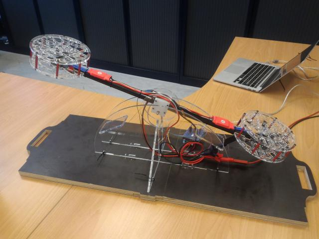
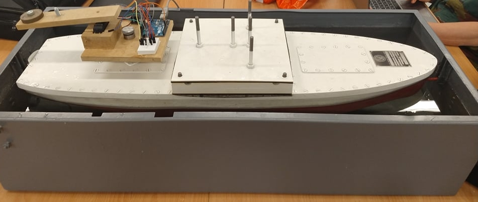
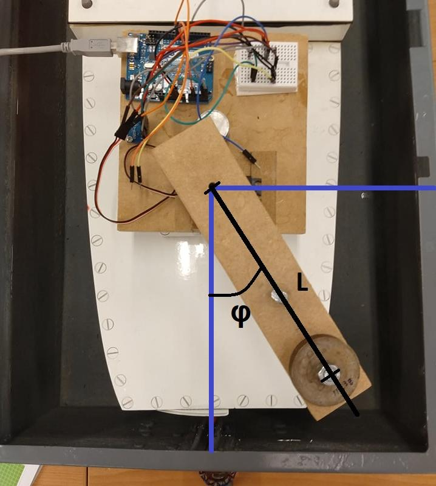
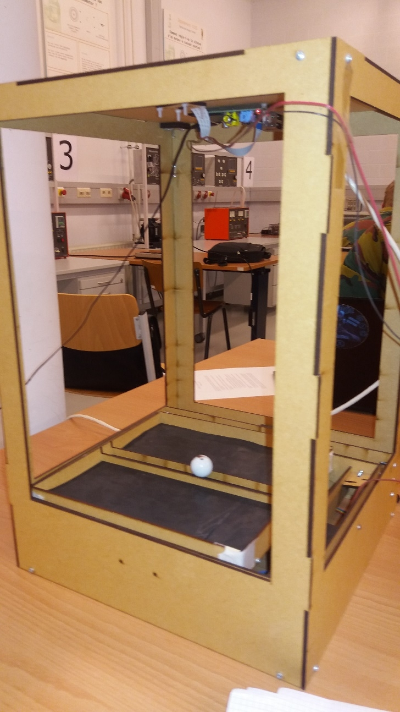
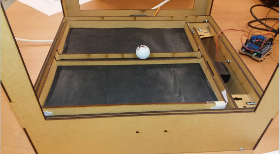
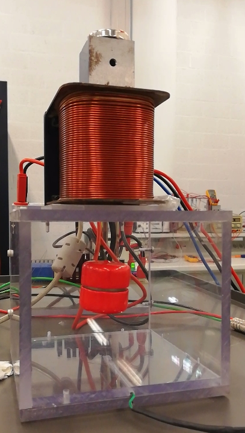
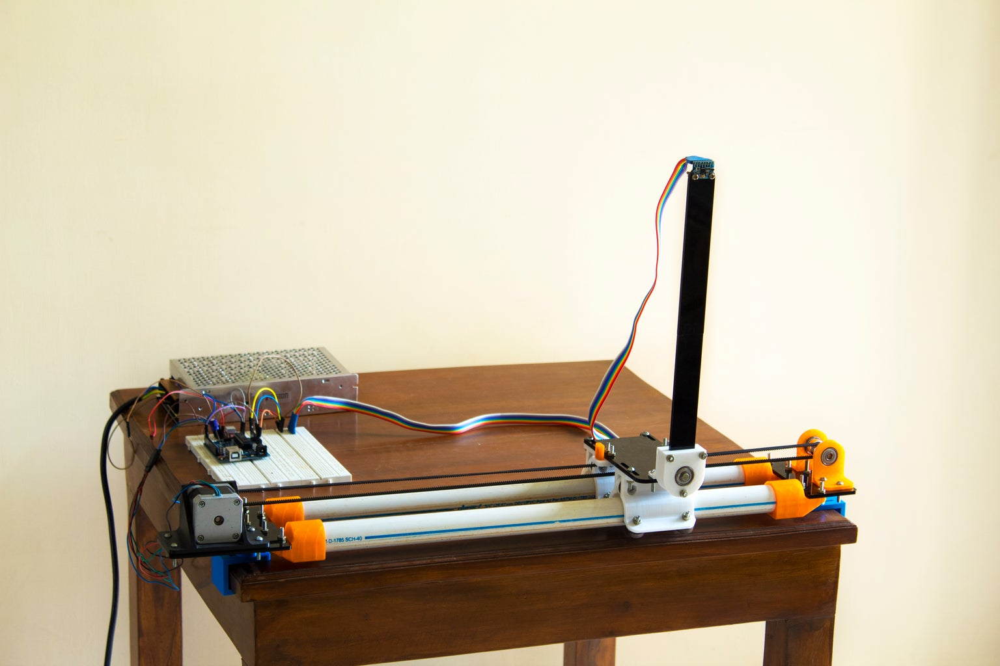

# Part of the course ES323 - Control Systems project.

Instruction videos:
* [General instructions and bicopter](https://youtu.be/RkP7duME04g)
* [Ship](https://youtu.be/MT4inNxh6Ik)
* [Magnetic Levitation](https://youtu.be/1t1lSZ-Gydc)
* [Ball on Beam](https://youtu.be/IkTkY4SD-5k)

## Requirements:
* matlab
* python 3 (3.6 or higher)
* numpy
* matplotlib (for visualization)

## General instructions:
1. Download the files, either with `git clone` (preferred) or by downloading all the files in zip format (choose `Clone or download` in the top right corner).
1. Unzip the files (if needed). Open a command window and `cd` into the newly created directory.
1. Start the system simulator: `python3 system.py [bob|ship|maglev|bicopter]`.
Specifying the type of system to simulate is mandatory.   
(Measurement noise is activated by default. You can deactivate it by adding the `no_noise` keyword.)
1. Start, in a new command window, the controller which implements the communication with the simulated system and matlab: `python3 controller.py [tcp_port]`. 
Students should only adapt the classes `Controller` and `Observer`. The `Controller` class takes the measurement `y` and produces the system input `u`. It returns a tuple with two elements:
    1. The command `u` that will be send to the system;
    1. A list of items that will be returned to Matlab, e.g. the list `[y, u]`

    The `Observer` class should be used to implement the observer in the second phase of the project.
1. Add the folder `matlab_tools` to the matlab path and run the matlab script:
    * connect to `controller.py` with `arduino = tcpclient('localhost', tcp_port);`
    * set mode and reference value with `set_mode_params(arduino, mode, w, params)` where `mode` can be either `OPEN_LOOP`, `CLASSICAL`, `STATE_SPACE` or `EXTENDED`. These same modes should also be defined in `Controller`.  
    The `params` argument is a list of free variables that can be used to communicate with the `python` controller.
    * get a response of the system with `Y = get_response(arduino, w, n_samples)` where `Y` is a matrix of size `n_items x n_samples`. `Y` contains the different elements returned by the `Controller` class for the entire sampling interval. E.g. if the controller returns `[y, u]`, the first row of `Y` will contain all the measurements `y` and the second row will contain the commands `u` generated by the controller.
    * reset the system to its initial state by using `reset_system(arduino)`
    * apply a disturbance (interpretation is system-specific) with `set_disturbance(arduino, disturbance)`.

## Specific instructions
All parameters of the systems can be found in the `.params` dictionary of each `System` object in `system.py`.

### Bicopter
Two rotors are attached to the ends of pole that can rotate around its axis. It makes an angle `theta` with the horizontal.

(See also [here](https://www.youtube.com/watch?v=VhRhwY8sl6A&ab_channel=XavierNeyt))

* state vars = [`theta`, `omega`]
* init_state = [0.0, 0.0] - in radians and radians/sec
* limits on state: -10.0° < `theta` < 10.0°
* input = the difference in voltage `V` that is applied to the motors that drive both rotors
* limits on input: -10.0 < `V` < 10.0 
* measurement: `theta`
* disturbance = a torque `T` [Nm] applied to the rotation axis.

### Ship
A ship is lying in a bassin of water. The mass at the end of a pole if mounted on top of the ship and can rotate (angle `phi`) around a vertical axis to steer the behavior of the ship around its axis (angle `theta`).

* state vars = [`theta`, `omega`]
* limits on state: -1.0 < `theta` < 1.0
* init_state = [0.0, 0.0] - in radians and radians/sec
* input = angle `phi` [radians]
* limits on input: -pi/2 < `phi` < pi/2

* measurement: `theta`
* disturbance = an acceleration applied to the ship. Toggle this to simulate a push to the side of the ship.

### Ball On Beam
A small ball can roll over a beam. This beam can rotate around its axis and the rotation angle `alpha` can be set directly (i.e. no delay because of the servo-motor that rotates the plane).

* state vars = [`x`, `v` ] - the position and speed of the ball
* limits on state: -1.0 < `x` < 1.0
* init_state = [1.0, 1.0]  - in [m] and [m/s]
* input = angle `alpha`
* limits on input: -10.0° < `alpha` < 10.0°
* measurement: position on beam `x` with a camera mounted above the setup - thus the projection of `x` in the horizontal plane.
* disturbance = an acceleration applied to the ball. Toggle this to simulate a push to the ball.

### Magnetic Levitation
A small iron ball is put inside a magnetic field. The strength of this magnetic field can be controlled by means of a current `I` through an inductance.

* state vars = [`z`, `v`] where `z` is the vertical distance ([cm]), measured from the top of the box in which the ball is confined. `v` is the vertical velocity.
* limits on state: 0.0 < `z` < 10.0
* init_state = [5.0, 0.0]
* input = current `I` [A]
* limits on input: 0.0 < `I` < 20.0
* disturbance: the `set_disturbance` function here limits the minimum value of `z`. This is needed to do the identification and parameter estimation of the system.

## Inverted Pendulum
**This project is still experimental. **  
The classic inverted pendulum, where you must move a cart to keep the pendulum in a vertical position.

* state vars = [`x`, `v`, `theta`, `omega`] with `x` [m] and `v` [m/s] the position and velocity of the cart, and `theta` and `omega` the angle [rad] and angular velocity [rad/s] of the pendulum with respect to the vertical.
* limits on state: -1 < `x` < 1 and -pi/2 < `theta` < pi/2
* init_state = [0.0, 0.0, 0.0, 0.0]
* input = a force `F` [N] applied to the cart
* limits on input: -10 < `F` < 10